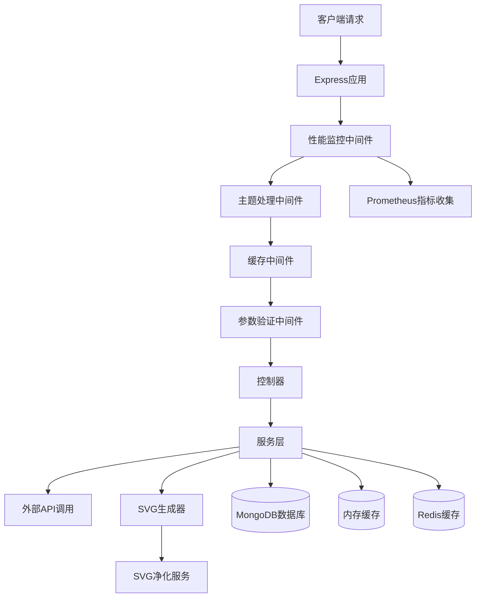

# GitHub Profile Statistics Card - 部署指南与架构说明

## 项目概述

这是一个功能丰富的开源项目，用于生成GitHub、LeetCode、CSDN、掘金和B站的个人统计数据卡片，支持SVG格式输出，可嵌入到GitHub个人资料页面或任何支持图片的位置。

## 架构优化成果

### 1. 核心架构改进



### 2. 关键优化亮点

#### 2.1 错误处理机制
- **统一错误响应格式**：实现了标准化的错误响应对象，包含错误码、错误信息和详细描述
- **分层错误处理**：业务错误、网络错误、安全错误等不同类型的错误有专门的处理逻辑
- **错误日志增强**：记录详细的错误上下文，便于问题定位
- **优雅降级**：当外部API调用失败时，尝试使用缓存数据返回

#### 2.2 安全增强
- **SVG内容过滤**：实现了专业的SVG净化服务，移除潜在的XSS攻击向量
- **输入验证**：严格的参数验证，防止注入攻击
- **CORS配置优化**：安全的跨域资源共享策略
- **限流保护**：防止恶意请求和DDoS攻击

#### 2.3 缓存优化
- **多级缓存策略**：MongoDB持久化缓存 + Node-Cache内存缓存 + Redis高性能缓存
- **智能缓存键生成**：基于用户ID、请求参数和主题的唯一缓存键
- **可配置TTL**：针对不同数据源设置合理的缓存过期时间
- **缓存命中率监控**：实时跟踪缓存效果并提供优化依据
- **Redis缓存支持**：使用Redis作为主要缓存系统，提供更高的性能和可扩展性

#### 2.4 监控与可观测性
- **Prometheus集成**：全面的指标收集，包括请求计数、响应时间、错误率等
- **健康检查端点**：提供系统运行状态和资源使用情况
- **实时统计API**：可视化系统运行指标
- **内存使用监控**：防止内存泄漏和资源耗尽

#### 2.5 测试覆盖
- **单元测试**：控制器、服务层、中间件的全面测试
- **边界情况测试**：各种异常输入和错误场景的处理验证
- **性能测试**：缓存效果和响应时间基准测试
- **安全测试**：XSS防护和输入验证测试

## 部署指南

### 1. 环境要求

- Node.js 16.x 或更高版本
- npm 8.x 或更高版本
- MongoDB 5.x 或更高版本（可选，用于持久化缓存）
- Redis 6.x 或更高版本（可选，用于高性能缓存）
- 服务器推荐配置：2GB RAM，1个CPU核心（支持中等流量）

### 2. 安装步骤

#### 2.1 克隆代码库

```bash
git clone https://github.com/yourusername/github-profile-statistics-card.git
cd github-profile-statistics-card
```

#### 2.2 安装依赖

```bash
npm install
```

#### 2.3 配置环境变量

创建 `.env` 文件，根据需要设置以下环境变量：

```dotenv
# 服务器配置
PORT=3000
NODE_ENV=production

# MongoDB连接信息（可选）
MONGODB_URI=mongodb://localhost:27017/github-stats-card
MONGODB_USERNAME=<your_mongodb_username>
MONGODB_PASSWORD=<your_mongodb_password>

# Redis连接信息（可选，用于高性能缓存）
REDIS_HOST=localhost
REDIS_PORT=6379
REDIS_USERNAME=default
REDIS_PASSWORD=<your_redis_password>

# API限流配置
RATE_LIMIT_WINDOW_MS=60000
RATE_LIMIT_MAX=100

# 缓存配置
DEFAULT_CACHE_TTL=300
GITHUB_CACHE_TTL=300
LEETCODE_CACHE_TTL=1800
CSDN_CACHE_TTL=1800
JUEJIN_CACHE_TTL=1800
BILIBILI_CACHE_TTL=1800

# 请求超时设置（毫秒）
REQUEST_TIMEOUT=10000
```

#### 2.4 构建项目

```bash
npm run build
```

#### 2.5 启动服务

##### 开发环境

```bash
npm run dev
```

##### 生产环境

```bash
npm start
```

### 3. Docker部署

#### 3.1 构建Docker镜像

```bash
docker build -t github-stats-card .
```

#### 3.2 运行Docker容器

```bash
docker run -d \
  -p 3000:3000 \
  -e PORT=3000 \
  -e MONGODB_URI=mongodb://mongodb:27017/github-stats-card \
  --name github-stats-card \
  github-stats-card
```

#### 3.3 Docker Compose（推荐）

创建 `docker-compose.yml` 文件：

```yaml
version: '3'
services:
  app:
    build: .
    ports:
      - "3000:3000"
    environment:
      - PORT=3000
      - MONGODB_URI=mongodb://mongodb:27017/github-stats-card
      - REDIS_HOST=redis
      - REDIS_PORT=6379
      - NODE_ENV=production
    depends_on:
      - mongodb
      - redis
    restart: always
    healthcheck:
      test: ["CMD", "curl", "-f", "http://localhost:3000/health"]
      interval: 30s
      timeout: 10s
      retries: 3

  mongodb:
    image: mongo:5
    volumes:
      - mongo-data:/data/db
    restart: always
    healthcheck:
      test: ["CMD", "mongo", "--eval", "db.adminCommand('ping')"]
      interval: 30s
      timeout: 10s
      retries: 3

  redis:
    image: redis:6
    restart: always
    healthcheck:
      test: ["CMD", "redis-cli", "ping"]
      interval: 30s
      timeout: 10s
      retries: 3
    command: redis-server --appendonly yes

volumes:
  mongo-data:
```

启动服务：

```bash
docker-compose up -d
```

### 3.4 Redis Cloud配置

为了提升应用性能和响应速度，推荐使用Redis Cloud服务。Redis Cloud提供了简单易用的云托管Redis解决方案。

1. 注册 [Redis Cloud](https://redis.com/try-free/) 账户（提供30天免费试用）
2. 创建新的Redis数据库实例
3. 获取连接信息：
   - Redis主机地址（Endpoint）
   - Redis端口（Port）
   - Redis密码（Password）
4. 将这些信息配置到环境变量中：

```dotenv
REDIS_HOST=your-redis-host.redislabs.com
REDIS_PORT=12345
REDIS_USERNAME=default
REDIS_PASSWORD=your-redis-password
```

Redis Cloud的优势：
- 无需自行维护Redis服务器
- 自动备份和故障恢复
- 可视化监控面板
- 多区域部署支持
- 自动扩缩容能力

### 4. 反向代理配置

如果使用Nginx作为反向代理，推荐以下配置：

```nginx
server {
    listen 80;
    server_name stats.example.com;

    location / {
        proxy_pass http://localhost:3000;
        proxy_http_version 1.1;
        proxy_set_header Upgrade $http_upgrade;
        proxy_set_header Connection 'upgrade';
        proxy_set_header Host $host;
        proxy_set_header X-Real-IP $remote_addr;
        proxy_set_header X-Forwarded-For $proxy_add_x_forwarded_for;
        proxy_set_header X-Forwarded-Proto $scheme;
        proxy_cache_bypass $http_upgrade;
    }

    # 静态文件缓存优化
    location ~* \.(svg)$ {
        proxy_pass http://localhost:3000;
        expires 10m;
        add_header Cache-Control "public, max-age=600";
    }
}
```

## 监控与维护

### 1. 监控端点

- **Prometheus指标**：`/metrics` - 用于Prometheus抓取
- **JSON格式指标**：`/metrics/json` - 用于API调用和调试
- **健康检查**：`/health` - 系统运行状态
- **统计信息**：`/stats` - 应用关键指标汇总

### 2. 常见问题排查

#### 2.1 缓存不生效
- 检查缓存TTL配置是否合理
- 确认缓存键生成逻辑是否正确
- 查看缓存服务日志，验证缓存操作

#### 2.2 外部API调用失败
- 检查网络连接和代理设置
- 验证请求头和用户代理配置
- 查看是否触发了目标平台的限流

#### 2.3 性能问题
- 监控内存使用情况，防止内存泄漏
- 调整缓存策略，提高缓存命中率
- 优化数据库查询，添加适当索引

### 3. 扩展建议

- **CDN集成**：使用Cloudflare等CDN进一步缓存静态SVG内容
- **水平扩展**：配置Redis等分布式缓存，支持多实例部署
- **监控告警**：集成Grafana和Alertmanager，设置性能和可用性告警
- **自动扩缩容**：在Kubernetes环境中配置HPA，根据负载自动调整实例数
- **Redis优化**：使用Redis Cloud等托管服务获得更好的性能和可靠性
- **缓存策略调优**：根据不同数据源的特点调整缓存TTL和淘汰策略

## API文档

### 1. GitHub统计

```
GET /github/:username?theme=default
```

### 2. LeetCode统计

```
GET /leetcode/:username?theme=default&cn=false
```

### 3. CSDN统计

```
GET /csdn/:userId?theme=default
```

### 4. 掘金统计

```
GET /juejin/:userId?theme=default
```

### 5. B站统计

```
GET /bilibili/:uid?theme=default
```

### 6. 可用主题

- `default` - 默认亮色主题
- `dark` - 暗色主题
- `merko` - Merko主题
- `gruvbox` - Gruvbox暗色主题
- `gruvbox_light` - Gruvbox亮色主题
- `tokyonight` - Tokyo Night主题
- `onedark` - One Dark主题

## 性能优化最佳实践

1. **合理设置缓存时间**：根据数据源的更新频率调整TTL
2. **启用数据库索引**：为频繁查询的字段添加索引
3. **配置适当的超时时间**：避免长时间阻塞请求处理
4. **使用连接池**：优化数据库连接和HTTP客户端
5. **定期重启服务**：对于长期运行的生产环境，设置定期重启机制防止内存泄漏

## 贡献指南

欢迎提交Issue和Pull Request。贡献前请确保：

1. 编写单元测试，确保代码覆盖率
2. 遵循项目的代码风格规范
3. 添加适当的注释和文档
4. 验证功能在不同环境下正常工作

## 许可证

本项目采用MIT许可证。详情请查看LICENSE文件。