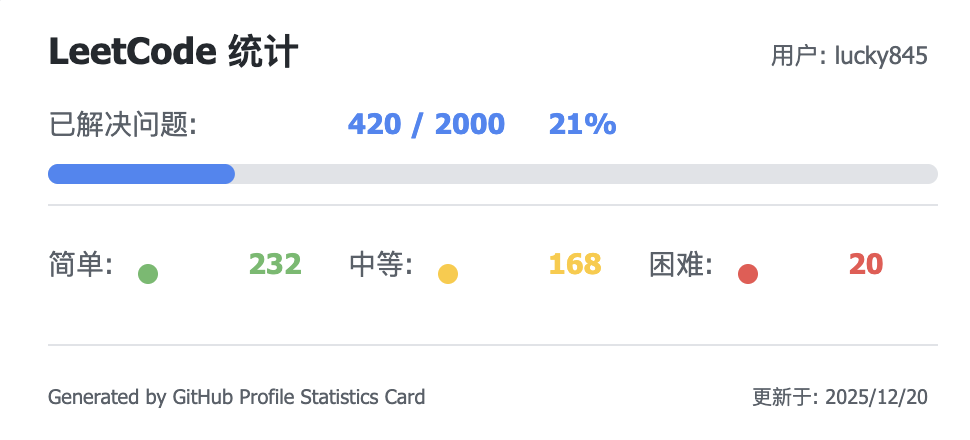
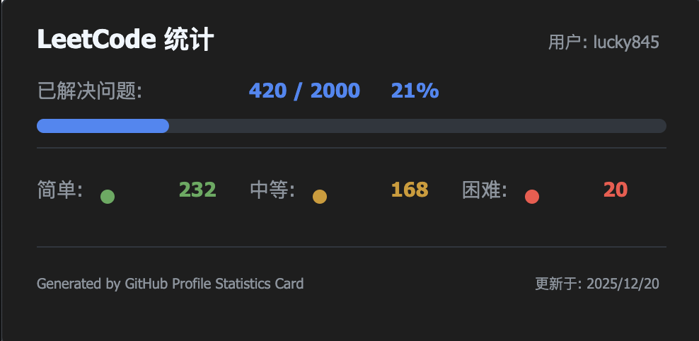
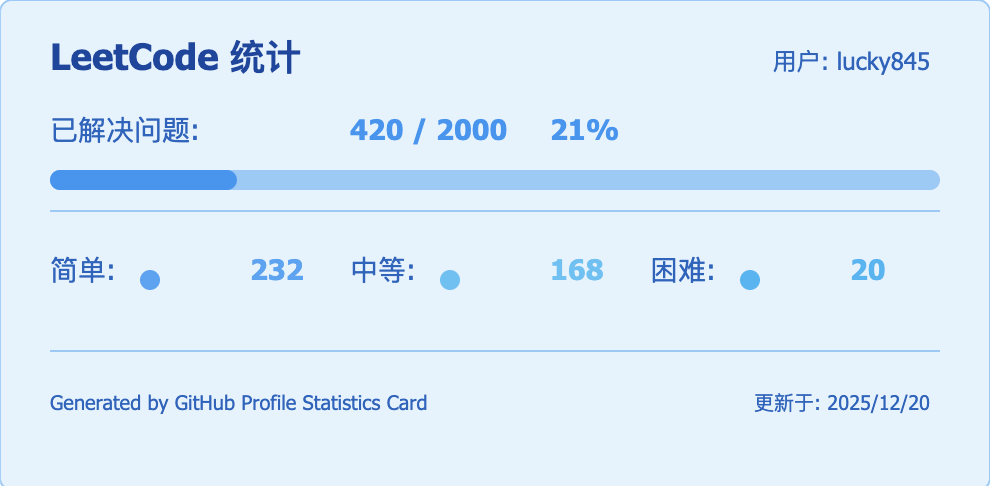
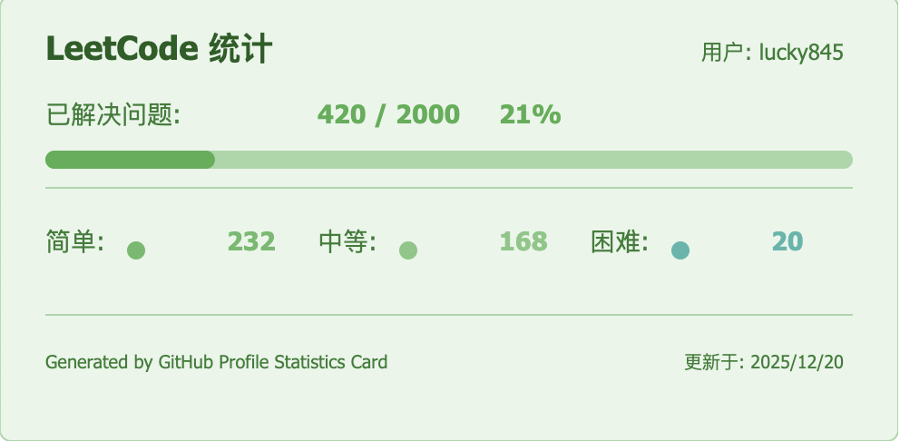
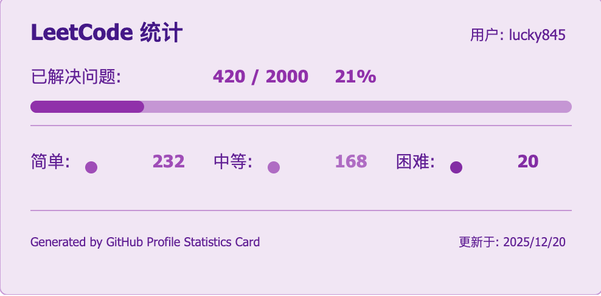
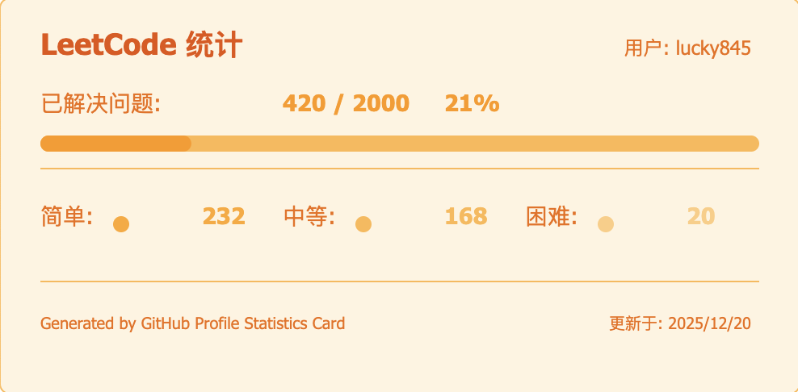
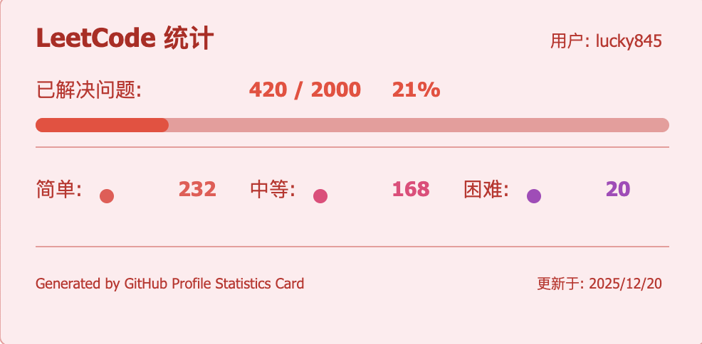

# GitHub Profile Statistics Card

<div align="center">
  
  
  
  
</div>

## 🚀 项目简介

GitHub Profile Statistics Card 是一个功能强大的开源工具，用于生成个人统计数据的SVG卡片。支持多种平台的数据展示，可直接嵌入到GitHub个人资料页或任何支持图片的位置。

### 🔥 核心功能

- **多平台支持**：GitHub、LeetCode、CSDN、掘金、B站数据统计
- **可定制主题**：多种精美主题可选，支持亮色/暗色模式
- **高度优化**：多级缓存策略，基于Redis的高性能缓存系统，确保快速响应
  - GitHub服务实现5分钟缓存，显著减少重复请求的响应时间
  - Redis连接池优化，最大连接数限制为10，避免"ERR max number of clients reached"错误
- **安全可靠**：内置SVG内容过滤，防止XSS攻击
- **实时监控**：集成Prometheus，全面的性能监控
- **完整测试**：全面的单元测试和边界情况覆盖

## 🌟 特性

- 支持多个平台数据统计
  - GitHub 统计数据
  - LeetCode 刷题数据
  - CSDN 博客数据
  - 掘金
  - 哔哩哔哩
  - 更多平台持续添加中...
- 自定义主题支持
  - 明亮主题
  - 暗黑主题
- 实时数据更新
- 简单易用的API
- 响应式设计
- 基于Redis的高性能缓存优化

## 🚀 使用方法

### GitHub 统计卡片

```markdown

```


### LeetCode 统计卡片

```markdown

```


支持参数：
- `username`: LeetCode 用户名
- `theme`: 主题选择（可选，默认为 light）
- `cn`: 是否获取中国区数据（可选，默认为 false）
  - `cn=true`: 获取 leetcode-cn.com 的数据
  - 不携带该参数: 获取 leetcode.com 的数据
- `cacheSeconds`: 配置缓存的秒数(默认120秒)

示例：
```markdown
# 获取 LeetCode 中国区数据


# 获取 LeetCode 美国区数据

```

### CSDN 统计卡片

```markdown

```


CSDN 统计卡片包含以下数据：
- 文章数量
- 粉丝数
- 点赞数
- 浏览量
- 评论数
- 积分
- ...

### 掘金统计卡片

```markdown

```


掘金统计卡片包含以下数据：
- 文章数量
- 关注者数量
- 点赞数
- 浏览量
- 个人简介
- ...

支持参数：
- `userId`: 掘金用户ID
- `theme`: 主题选择（可选，默认为 light）
- `cacheSeconds`: 配置缓存的秒数(默认120秒)

示例：
```markdown
# 使用暗黑主题

```

### 哔哩哔哩统计卡片

```markdown

```


哔哩哔哩统计卡片包含以下数据：
- 用户名称
- 粉丝数
- 关注数
- 获赞数
- 播放量
- 个人签名
- ...

支持参数：
- `uid`: 哔哩哔哩用户ID
- `theme`: 主题选择（可选，默认为 light）
- `cacheSeconds`: 配置缓存的秒数(默认120秒)

示例：
```markdown
# 使用暗黑主题

```

⚠️ 已知问题：
- 由于哔哩哔哩的等级是svg图片，用户等级信息可能无法正常获取
- 部分用户数据可能因为隐私设置而无法显示

## 🎨 主题配置

支持以下主题参数：
- `cacheSeconds`: 配置缓存的秒数(默认120秒)
- `theme=default` - 默认主题（明亮主题）
- `theme=light` - 明亮主题
- `theme=dark` - 暗黑主题
- `theme=blue` - 蓝色主题
- `theme=green` - 绿色主题
- `theme=purple` - 紫色主题
- `theme=orange` - 橙色主题
- `theme=red` - 红色主题

主题预览：

### Default（默认）
```markdown

```


### Dark
```markdown

```


### Blue
```markdown

```


### Green
```markdown

```


### Purple
```markdown

```


### Orange
```markdown

```


### Red
```markdown

```


## 🔜 即将支持的平台

- 知乎
- 微博
- ...更多平台开发中

## 🛠️ 技术栈

- Node.js
- Express
- TypeScript
- MongoDB
- Redis
- EJS 模板引擎

## 📝 开源协议

[Apache 2.0 许可证](LICENSE)

## 🚀 部署指南

### 准备工作

1. Fork 本项目到你的 GitHub 账户
2. 注册 [MongoDB Atlas](https://cloud.mongodb.com/) 账户
3. 注册 [Vercel](https://vercel.com/) 账户

### MongoDB Atlas 配置

1. 登录 MongoDB Atlas
2. 创建新的数据库集群（可以选择免费的共享集群）
3. 在 "Database Access" 中创建数据库用户
4. 在 "Network Access" 中添加 IP 访问权限（可以设置为允许所有 IP：0.0.0.0/0）
5. 获取数据库连接字符串（格式如：`mongodb+srv://<username>:<password>@cluster0.xxxxx.mongodb.net/`)

### Redis Cloud 配置

为了提升应用性能和响应速度，本项目使用Redis作为主要缓存系统。推荐使用Redis Cloud服务，它提供了简单易用的云托管Redis解决方案。

1. 注册 [Redis Cloud](https://redis.com/try-free/) 账户（提供30天免费试用）
2. 创建新的Redis数据库实例
3. 获取连接信息：
   - Redis主机地址（Endpoint）
   - Redis端口（Port）
   - Redis密码（Password）
4. 将这些信息配置到环境变量中

Redis Cloud的优势：
- 无需自行维护Redis服务器
- 自动备份和故障恢复
- 可视化监控面板
- 多区域部署支持
- 自动扩缩容能力

### Redis 连接池配置

为了有效管理Redis连接并避免连接数过多导致的问题，本项目实现了Redis连接池机制：

- **最大连接数限制**：连接池最大连接数设置为10，适合免费Redis服务的连接数限制
- **连接复用**：通过连接池复用连接，减少连接建立和关闭的开销
- **自动重连**：连接断开时自动重新连接
- **超时控制**：设置获取连接的超时时间为5秒，避免长时间等待

连接池配置参数：
- `minimum`: 最小连接数（默认1）
- `maximum`: 最大连接数（默认10）
- `acquireTimeout`: 获取连接超时时间（默认5000ms）
- `cleanupDelay`: 清理延迟时间（默认3000ms）

### Vercel 部署

1. 在 Vercel 中导入你 fork 的项目
2. 配置环境变量：
   - `MONGODB_URI`: MongoDB Atlas 的连接字符串
   - `BILIBILI_SESSDATA`: 哔哩哔哩登录后获取的cookie里面的`SESSDATA`值
   - `USE_MEMORY_CACHE`: 本地开发时设置为true使用内存缓存（可选，线上环境未配置时默认使用MongoDB）
   - `REDIS_HOST`: Redis服务器主机地址（使用Redis Cloud时为云端提供的主机地址）
   - `REDIS_PORT`: Redis服务器端口（使用Redis Cloud时为云端提供的端口）
   - `REDIS_PASSWORD`: Redis访问密码（使用Redis Cloud时为云端提供的密码）
   - `REDIS_USERNAME`: Redis用户名（使用Redis Cloud时通常为'default'）
3. 点击 "Deploy" 开始部署

部署完成后，你可以通过 Vercel 分配的域名访问服务，格式如：
```markdown

```

## 🤝 参与贡献

我们非常欢迎各种形式的贡献！以下是一些参与项目的方式：

### 贡献步骤

1. Fork 本项目
2. 创建你的特性分支 (`git checkout -b feature/AmazingFeature`)
3. 提交你的改动 (`git commit -m 'Add some AmazingFeature'`)
4. 推送到分支 (`git push origin feature/AmazingFeature`)
5. 发起 Pull Request

### 贡献类型

- 🐛 提交 bug 修复
- ✨ 添加新功能
- 📝 改进文档
- 🎨 优化界面
- 🔧 改进配置
- 🌐 添加新的平台支持

### 开发指南

1. 克隆项目到本地：
```bash
git clone https://github.com/your-username/github-profile-statistics-card.git
cd github-profile-statistics-card
```

2. 安装依赖：
```bash
npm install
```

3. 创建 `.env` 文件并设置环境变量：
```
MONGODB_URI=your_mongodb_uri
```

4. 启动开发服务器：
```bash
npm run dev
```

5. 构建项目：
```bash
npm run build
```

6. 运行生产版本：
```bash
npm start
```

> 说明：本项目使用TypeScript开发，已优化编译配置，构建输出文件将存放在`dist`目录中，确保源代码与编译产物分离，提高项目结构清晰度。项目使用`tsc-alias`处理路径别名，确保编译后的代码能够正确解析模块引用。

### 提交规范

提交信息请遵循以下格式：
- `feat`: 新功能
- `fix`: 修复问题
- `docs`: 文档修改
- `style`: 代码格式修改
- `refactor`: 代码重构
- `test`: 测试用例修改
- `chore`: 其他修改

例如：`feat: 添加 bilibili 数据统计支持`

## 📬 联系方式

如有问题或建议，欢迎通过以下方式联系：

- 提交 Issue
- 发送邮件至：[1447545564@qq.com]

---

如果这个项目对你有帮助，请给个 Star ⭐️ 
